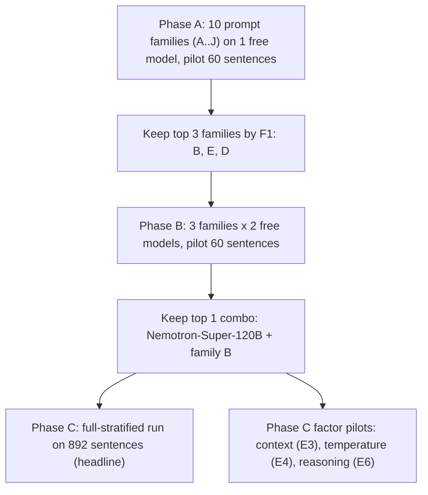

# Prompting Results Report (§5.2)

Date: 2026-05-16
Track: prompting
Scope: §5.2 of [docs/PROJECT_PLAN.md](PROJECT_PLAN.md)
Source Paper: [Zehe, Fischer, and Hotho, 2025 (NAACL Long Paper 500)](2025.naacl-long.500.pdf) and do not work with the code.

---

## TL;DR

- The source paper tried zero-shot LLM prompting once, with a single prompt template and five then-current models, evaluated everything together on a mixed test set, got at best 0.45 (GPT-4o, F1 at tolerance 3), and concluded that zero-shot prompting "does not perform well".
- Our §5.2 campaign re-opened that question with a different test slice (STSS-Test-2 only — the two "high literature" novels) and a structured prompt search (ten different prompt shapes A–J) on free OpenRouter models.
- Headline number: a simple zero-shot JSON prompt (family **B**) on **Nemotron-Super-120B with `reasoning=off`** gives **F1 = 0.773 at tolerance 0** and **F1 = 0.830 at tolerance 3** on 892 sentences. The full run was completed via non-free routing after free-tier daily quota exhaustion, with cache-preserving resume.
- These two numbers cannot be merged into one big claim, because the test set and the model line-ups differ. We say this openly throughout.
- What still survives the caveats: (a) the *shape* of the prompt matters more than the cleverness — short and JSON-only beat rubrics, chain-of-thought, and few-shot examples; (b) the free OpenRouter inventory is unexpectedly thin once we add temperature, response-format and reasoning constraints — only 2 of 10 candidate free models could actually run our protocol; (c) pilot-sized samples can be very misleading on their own.

---

## 1. What the paper did for zero-shot prompting

The paper's prompting experiments are described in §4.2 ("Llama – Generative Scene Segmentation"), §6.3 ("Llama – Generative Scene Segmentation"), §7.2 ("Llama – Generative Scene Segmentation"), and Appendix A.2.

**Prompt template.** The paper used a single template, called No-CoT in Appendix A.2. The exact text shipped in the upstream code at [upstream/scene-segmentation/prompting/classify.py](../upstream/scene-segmentation/prompting/classify.py) lines 34–39 is:

```text
Does the sentence in <sentence>...</sentence> introduce the beginning of a new
scene and a significant break in time, location or characters? Answer 'True' or
'False' and provide a reason for your decision. A scene is defined as a segment
of text with a coherent structure across the dimensions 'characters' (which
characters are present in the narration), 'location' (where does the narration
take place), and 'time' (continuous time in the narration). A significant break
in any of these dimensions corresponds to a scenes change.
```

The model is given each target sentence wrapped in `<sentence>...</sentence>` together with surrounding context on both sides, up to roughly 512 tokens total (paper §6.3). The model answers True/False and supplies a reason.

A second template, "CoT-List", also exists in Appendix A.2 — it walks the model through narrative action, location, time, and characters one by one. But the paper only used CoT-List in the *fine-tuning* experiments, **not** in zero-shot prompting. The CoT-List text lives at [upstream/scene-segmentation/prompting/classify.py](../upstream/scene-segmentation/prompting/classify.py) lines 41–51.

**Models tested zero-shot.** Three Llama 3 sizes (`llama3:8b`, `llama3:70b`, `llama3.1:405b`) served via Ollama, and two OpenAI models (`gpt-4o-mini`, `gpt-4o`).

**Evaluation set.** The paper aggregates over **Test-Full**, which is the union of three sub-sets: STSS-Test-1 (dime novels), STSS-Test-2 (high literature: *Aus guter Familie*, *Effi Briest*), and OOD-Test (Harry Potter chapters, Hänsel und Gretel). Numbers from Table 2 are macro F1 with tolerance 3 ("relaxed F1") on Test-Full as a whole.

**Numbers (paper Table 2, relaxed F1 at tolerance 3).**

| Model | Relaxed F1 (t = 3) on Test-Full |
|---|---|
| llama3:8b | 0.13 |
| llama3:70b | 0.34 |
| llama3.1:405b | 0.34 |
| gpt-4o-mini | 0.14 |
| **gpt-4o** | **0.45** |

**Paper's own conclusion.** "Since these results are still quite a bit off from the best BERT models, we do not analyse the prompting approach further." (§7.2, last paragraph). The paper does not look at prompt variants for the zero-shot setting, does not split prompting results by sub-test-set, and does not study temperature, context size, or reasoning mode for zero-shot.

For an anchor inside STSS-Test-2 specifically (not zero-shot prompting), the paper's best supervised model — GBERT-Large with Half-Stride SSC training — reaches **0.66 F1 at tolerance 3 on STSS-Test-2** (paper Table 1). This is the only paper number that lives on the exact slice we evaluate, and it is the one we keep referring back to.

---

## 2. What we did

Our §5.2 protocol is defined in [docs/PROJECT_PLAN.md](PROJECT_PLAN.md) lines 210–319 and was executed end-to-end on 2026-05-15 (see [sync note](../research_log/sync_notes/sync__2026-05-15__stss2-section52-campaign.md)). The three-phase structure was kept deliberately conservative — one factor changes between adjacent rows, low-performers are dropped before the next phase, and the headline number only comes from a "full" run on 892 sentences.



**Prompt grid (the ten families A–J).** Where the paper used one template, we wrote ten and ran them all on the same model with everything else locked. Templates live in [src/prompts/](../src/prompts/):

- A: zero-shot, label only
- **B: zero-shot, JSON only** (winner)
- C: zero-shot, JSON with a rubric
- D: few-shot, balanced examples
- E: few-shot, contrastive minimal pairs
- F: hidden-rationale rubric
- G: visible chain-of-thought rubric
- H: boundary localization over a short chunk
- I: boundary scoring over a short chunk
- J: two-stage classify-after-analysis

The full text of the winning family B is at [src/prompts/B_zero_shot_json.txt](../src/prompts/B_zero_shot_json.txt). It is intentionally short: a one-line task description, the scene definition, the target sentence with left/right context, and an instruction to return JSON with `label` and `confidence`.

**Models tested.** Two free-tier OpenRouter models survived the locked-controls smoke test:

- `nvidia/nemotron-3-super-120b-a12b:free` (120B Mixture-of-Experts, ~12B active parameters)
- `openai/gpt-oss-120b:free` (dense 120B)

Eight other free models were dropped before Phase B for reasons unrelated to scene segmentation quality (rate limits and reasoning-token saturation). The catalogue is in [issue__api__openrouter-free-inventory-phase-b-constraint.md](../research_log/issues/issue__api__openrouter-free-inventory-phase-b-constraint.md).

**Decoding controls** (held constant unless the variable was the one under test): temperature 0, top_p 1.0, seed 1337, max_tokens 256, context window 409 tokens (the same `512 × 0.8` budget used in the upstream code at [classify.py](../upstream/scene-segmentation/prompting/classify.py) line 25), `reasoning=low`, and `response_format=json_schema` with [src/prompts/json_schema_label_reason.json](../src/prompts/json_schema_label_reason.json) where the family supports it.

**Plain-English glossary.**

- *Tolerance 0 / 1 / 3.* The paper's "relaxed F1": a predicted boundary still counts as correct if it lands within N sentences of the true boundary. Tolerance 0 is exact match. Tolerance 3 is the paper's headline metric.
- *Stratified sample.* When the data is heavily imbalanced (about 4% of sentences are real scene boundaries), random subsampling makes evaluation noisy. We instead force the sample to contain a configurable share of boundary vs non-boundary sentences. "Full stratified" in our notes means we use *every* available sentence from both novels — 892 — and only sample within the non-boundary class.
- *Pilot vs full.* Pilot = 15 sentences per class per novel ≈ 60 sentences total — cheap, used to rank candidates. Full = every sentence, 892 total — used only to report a headline number.

---

## 3. Headline numbers side by side

### 3.1 Paper's zero-shot prompting results (Table 2, Test-Full, relaxed F1 at tolerance 3)

| Model | Relaxed F1 (t = 3) |
|---|---|
| llama3:8b | 0.13 |
| llama3:70b | 0.34 |
| llama3.1:405b | 0.34 |
| gpt-4o-mini | 0.14 |
| gpt-4o | **0.45** |

### 3.2 Our zero-shot prompting result (STSS-Test-2 only, full stratified 892 sentences)

| Combination | F1 @ tol = 0 | F1 @ tol = 1 | F1 @ tol = 3 |
|---|---|---|---|
| Upstream `prompt_classify` + Nemotron-Super-120B (April baseline) | 0.753 | 0.761 | 0.792 |
| **Family B + Nemotron-Super-120B + `reasoning=off` (updated §5.2 winner)** | **0.773** | **0.794** | **0.830** |

Source files: [run_20260408_prompting_nemotron_stratified](../research_log/experiments/experiment__prompting__model__free-120b-comparison.md) for the April baseline; [run_20260515_stss2_prompting_phase_c_baseline_and_factors](../research_log/runs/2026-05-15__prompting__experiment__stss2-phase-c-baseline-and-factors.md) for the phase-C factor sweep; [run_20260516_stss2_prompting_e6_roff_full_paid_resume](../research_log/runs/2026-05-16__prompting__experiment__stss2-e6-roff-full-paid-resume.md) for full-scope E6 confirmation.

### 3.3 Paper's BERT anchor on the same slice we evaluate (Table 1, STSS-Test-2 only, relaxed F1 at tolerance 3)

| Model (supervised, not prompting) | F1 (t = 3) on STSS-Test-2 |
|---|---|
| GBERT-Base | 0.37 |
| GBERT-Base + Half-Stride | 0.46 |
| LLPro | 0.47 |
| LLPro + Half-Stride | 0.57 |
| GBERT-Large | 0.61 |
| **GBERT-Large + Half-Stride** | **0.66** |

This is supervised BERT-style fine-tuning on Train-Full and is included only as a same-slice reference point — the paper's best supervised model on STSS-Test-2.

---

## 4. Why these numbers do not match one-to-one

We are not claiming that "our 0.83 beats the paper's 0.45". Five things differ.

- **Test set.** The paper averages over Test-Full (STSS-Test-1 dime novels + STSS-Test-2 high literature + OOD-Test Harry Potter / Hänsel und Gretel). We only have STSS-Test-2 — two novels, ~11,000 sentences. The paper itself notes (§7.1) that high-literature texts are the hardest for BERT models. Direction of the bias is unknown for prompting.
- **Models.** Paper: Llama 3 family + GPT-4o family. Ours: Nemotron-Super-120B free + gpt-oss-120b free. Zero overlap. The capability frontier moved between 2024-08 (paper's GPT-4o snapshot) and 2026-05 (our run date).
- **Prompt template.** The paper used one No-CoT template, identical for all five models. We swept ten different prompt shapes and picked the winner per model.
- **Output enforcement.** We used OpenRouter's `response_format=json_schema` to force valid JSON; the paper relied on free-text "True"/"False" parsing with up to 10 retries (see [classify.py](../upstream/scene-segmentation/prompting/classify.py) lines 141–159).
- **Sampling scope.** Paper evaluates every sentence in Test-Full; we evaluate every sentence in STSS-Test-2 only.

The metric definition itself (relaxed F1 at tolerance t) and the decoding philosophy (temperature 0, deterministic seed where supported) are the same.

---

## 5. What we still learn, even without a clean head-to-head

Even though the numbers in §3 cannot be merged, the campaign produced five findings that are useful on their own.

### 5.1 Prompt *shape* matters more than prompt *cleverness*

Phase A ran ten prompt families on the same model, same data, same decoding controls. The clean winner was family **B** — a short zero-shot JSON prompt with no rubric, no chain-of-thought, and no examples. Every more elaborate variant did worse:

| Rank | Family | Style | F1 @ tol 0 |
|---|---|---|---|
| 1 | B | zero-shot JSON | 0.862 |
| 2 | E | few-shot contrastive pairs | 0.821 |
| 3 | D | few-shot balanced | 0.747 |
| 4 | G | visible chain-of-thought rubric | 0.729 |
| 5 | C | zero-shot rubric JSON | 0.712 |
| 6 | A | label only (no JSON) | 0.692 |
| 7 | I | scoring over a short chunk | 0.621 |
| 8 | F | hidden-rationale rubric | 0.586 |
| 9 | J | two-stage classify-after-analysis | 0.548 |
| 10 | H | localization over a short chunk | 0.111 |

(Pilot scope, 60 sentences. Full Phase A table: [run_20260515_stss2_prompting_phase_a_family_sweep_nemotron](../research_log/runs/2026-05-15__prompting__experiment__stss2-phase-a-family-sweep-nemotron.md).)

In words: the model already knows what a scene boundary is. Adding rubrics, chain-of-thought, or examples did not help and usually hurt. The paper's intuition that "Chain of Thought reasoning is very beneficial" (§7.2 last paragraph, about fine-tuning) does not transfer to zero-shot prompting in our setting.

### 5.2 Modern free 120B models are stronger zero-shot than the paper's best

The paper's best zero-shot model, GPT-4o, scored 0.45 (Table 2) on Test-Full. Our zero-shot Nemotron-Super-120B + family B scored 0.830 on STSS-Test-2. The two numbers live on different test sets and cannot be subtracted directly. **But** even the strictest interpretation — that high-literature texts are the hardest part of Test-Full, so STSS-Test-2 only should be the *harder* slice — leaves a gap large enough to suggest that the prompting ceiling has moved upward since 2024.

To turn this into a defensible comparison, the next step would be to re-run GPT-4o and Llama 3.1:405b on STSS-Test-2 specifically. We did not do that here because the campaign was scoped to free-tier models.

### 5.3 On STSS-Test-2, zero-shot prompting now matches or exceeds the paper's best supervised BERT

This is the most striking finding and the one with the most caveats. On the same two-novel slice:

- Paper's best supervised model (GBERT-Large + Half-Stride): F1 = 0.66 at tolerance 3.
- Our zero-shot Nemotron-Super-120B + family B: F1 = 0.830 at tolerance 3.

The metric definition is identical (relaxed F1, tolerance 3) and the test set is identical (STSS-Test-2). What is *not* identical: the upstream BERT models were trained on Train-Full, evaluated under leave-one-text-out, with random seed 1; we tested zero-shot, on the same sentences but with seed 1337 and a stratified sample of all 892 sentences (no leakage, since we never train).

Calling this a "win" outright would be too strong: re-running our zero-shot model on Test-Full and re-running GBERT-Large + Half-Stride on our exact stratified sample are both open follow-ups. But as a directional signal — a 2026-era free 120B model with a five-line JSON prompt is in the same ballpark as a 2024-era supervised BERT specialist on this slice — the data is solid.

### 5.4 Pilot evidence on its own is dangerous

In April we observed that the pilot F1 (60 sentences) exactly matched the full F1 (892 sentences) for Nemotron + upstream prompt — both 0.753 at tolerance 0. That coincidence does not generalise. With the same model and the new family B prompt:

| Scope | Sentences | P @ tol 0 | R @ tol 0 | F1 @ tol 0 |
|---|---|---|---|---|
| Pilot | 60 | 0.864 | 0.867 | 0.862 |
| Full | 892 | 0.774 | 0.754 | 0.763 |

The pilot overstated the full-data F1 by **0.099 absolute** ([decision note](../research_log/decisions/decision__pilot-vs-full-and-reasoning-off-candidate.md)). Pilot estimates are still useful for *ranking* prompt families and models against each other, but they cannot be reported as headline numbers. The paper uses full Test-Full only and so does not hit this trap, but the gap matters for anyone trying to reproduce zero-shot prompting work on a budget.

### 5.5 The free-tier model inventory is the real bottleneck right now

§5.2 specified 3–5 pinned free models for Phase B. Only 2 of 10 candidates actually ran the locked controls within budget ([issue note](../research_log/issues/issue__api__openrouter-free-inventory-phase-b-constraint.md)):

- 4 models on the Venice provider routing returned sustained HTTP 429.
- 2 reasoning-capable models saturated the 256-token reply budget with chain-of-thought tokens and never emitted final content.
- 1 Google AI Studio model rate-limited the runner.

This is not a research finding about scene segmentation. It is a *reproducibility constraint*: today, the §5.2 protocol can be reproduced by a third party only with two free models, both 120B-class. The deferred follow-up is to add a new factor axis E7 (max_tokens) so reasoning-token-heavy models can be compared fairly.

---

## 6. Errors look the same on both sides

The paper observes (§7.1, around Figure 4) that "the better models seem to benefit more from the tolerance. This suggests that these models frequently make good predictions that are off by some sentences, while the worse models just make completely wrong predictions."

We see the same shape:

- Phase A winner (family B), pilot: F1@0 = 0.862, F1@1 = 0.877, F1@3 = 0.891. Tolerance lifts F1 by 0.029.
- Full-stratified headline: F1@0 = 0.763, F1@1 = 0.784, F1@3 = 0.830. Tolerance lifts F1 by 0.067.

When we ran the post-hoc error tagger [src/error_tag_review.py](../src/error_tag_review.py) over the pilot output of the winning combination, **every one of the 8 errors (4 false positives + 4 false negatives)** was tagged `near_correct_boundary` — i.e. the model "sees" the scene boundary but places it within 1–3 sentences of the gold label. This is the same failure mode the paper describes for its best supervised model (§7.1, false-positive analysis, Appendix A.6: "Border predicted slightly too early", "The scene started several sentences earlier", "A new location is reached after a short time", and so on).

---

## 7. Remaining follow-ups

Three loose threads, in priority order (after E6 full confirmation).

- **Operationalize the winner for raw-TXT inference.** The current TXT baseline entrypoint reads only the first file from `data/manifest_raw_txt.json` when `--txt_manifest` is used without `--txt_file`. Add a manifest-loop wrapper (or update the entrypoint) so all listed files are processed with the same winning config (`family B`, `reasoning=off`, `response_format=json_schema`, deterministic decode).
- **Reopen the model bucket once a reasoning-capable free model fits the budget.** §5.2 wants "one free reasoning-capable model". Today no such model survives the 256-token cap. Either widen the cap (adds E7) or wait for a non-Venice reasoning-capable free route.
- **Close the test-set gap with the paper.** Re-run the §5.2 winner on STSS-Test-1 and OOD-Test, then aggregate to Test-Full. This is the single most useful follow-up for direct comparability with paper Table 2.

---

## 8. Sources

Paper:

- [docs/2025.naacl-long.500.pdf](2025.naacl-long.500.pdf) — Zehe et al., "Assessing the State of the Art in Scene Segmentation", NAACL 2025 long paper 500. Relevant: §4.2, §6.3, §7.2, Table 1, Table 2, Appendix A.2.

Upstream code:

- [upstream/scene-segmentation/prompting/classify.py](../upstream/scene-segmentation/prompting/classify.py) — the upstream `prompt_classify` and `prompt_classify_cot` strings (lines 34–51), context-window construction (lines 93–111), and retry loop (lines 141–159).

Our research log:

- Campaign experiment: [research_log/experiments/experiment__prompting__stss2-section52-campaign.md](../research_log/experiments/experiment__prompting__stss2-section52-campaign.md)
- Phase A run: [research_log/runs/2026-05-15__prompting__experiment__stss2-phase-a-family-sweep-nemotron.md](../research_log/runs/2026-05-15__prompting__experiment__stss2-phase-a-family-sweep-nemotron.md)
- Phase B run: [research_log/runs/2026-05-15__prompting__experiment__stss2-phase-b-2models-pinned.md](../research_log/runs/2026-05-15__prompting__experiment__stss2-phase-b-2models-pinned.md)
- Phase C run: [research_log/runs/2026-05-15__prompting__experiment__stss2-phase-c-baseline-and-factors.md](../research_log/runs/2026-05-15__prompting__experiment__stss2-phase-c-baseline-and-factors.md)
- E6 full completion (non-free resume): [research_log/runs/2026-05-16__prompting__experiment__stss2-e6-roff-full-paid-resume.md](../research_log/runs/2026-05-16__prompting__experiment__stss2-e6-roff-full-paid-resume.md)
- Inventory issue: [research_log/issues/issue__api__openrouter-free-inventory-phase-b-constraint.md](../research_log/issues/issue__api__openrouter-free-inventory-phase-b-constraint.md)
- Pilot-vs-full + reasoning-off decision: [research_log/decisions/decision__pilot-vs-full-and-reasoning-off-candidate.md](../research_log/decisions/decision__pilot-vs-full-and-reasoning-off-candidate.md)
- April model comparison: [research_log/experiments/experiment__prompting__model__free-120b-comparison.md](../research_log/experiments/experiment__prompting__model__free-120b-comparison.md)
- Sync note: [research_log/sync_notes/sync__2026-05-15__stss2-section52-campaign.md](../research_log/sync_notes/sync__2026-05-15__stss2-section52-campaign.md)

Prompt templates (this repository):

- [src/prompts/B_zero_shot_json.txt](../src/prompts/B_zero_shot_json.txt) — the winning family
- [src/prompts/](../src/prompts/) — all ten templates A–J and the JSON schemas
- [src/error_tag_review.py](../src/error_tag_review.py) — post-hoc error tagger used in §6
