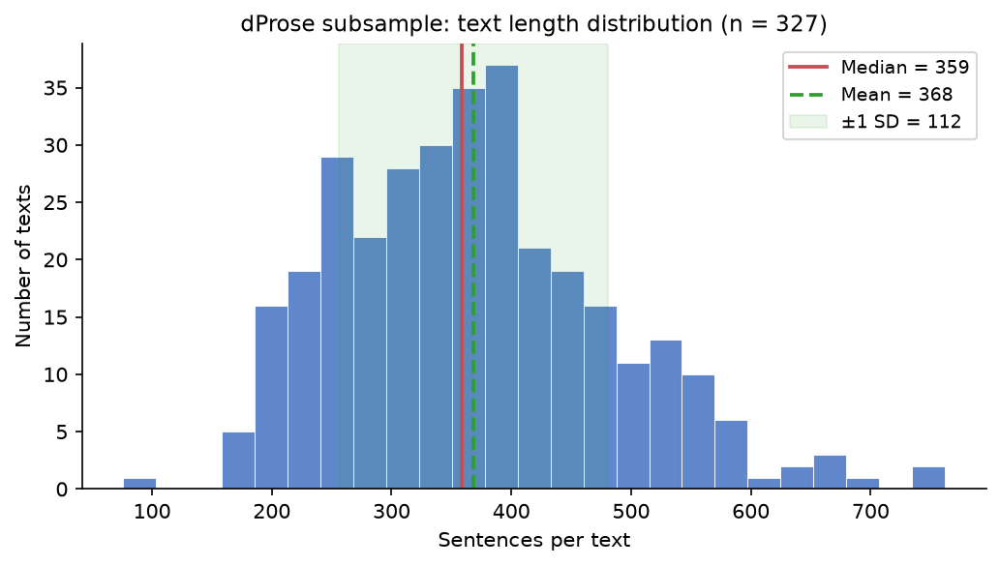
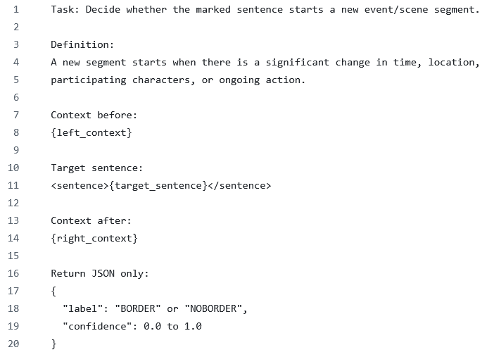

# Automatic Scene Segmentation in Narrative Texts

## Report in the Context of the EmoEvent-Project

### Overview / Purpose

This report stands in the context of our CHR-conference submission *EmoEvent: *xxx. It gives full details on our applied Gemini-pipeline focused on automatically and semantically segmenting literary texts into narrative scenes. Overall, we follow the the LLM-based approach evaluated by Zehe et al. (2025). By using human-labelled texts from our close-reading approach, Gemini's performance on the mentioned task is evaluated. In the end, we segment texts from our distant-reading approach by using Gemini.

### Data Description

#### Close-reading texts (labelled gold standard)

We use two texts from our close-reading approach: *Das Erdbeben in Chili* by Heinrich von Kleist (1807) and *Die Gänsemagd*, a fairy tale from the Brothers Grimm's *Kinder- und Hausmärchen* (edition XXXX).^[TODO-colleagues: specify exact edition of *Die Gänsemagd*.]

For Kleist's text, we reused manual scene annotations created in the context of the GermAn Prose dataset (Hatzel et al. 2026). For the fairy tale, we used the same annotation guidelines and collected the respective annotation data.^[TODO-colleagues: describe annotation setup for *Die Gänsemagd* — number of annotators, adjudication procedure, and IAA (if computed).]

The labelling task is binary at the sentence level: each sentence is assigned either BORDER (a new scene starts at this sentence) or NOBORDER (the current scene continues). The *Scene Rate* in the table below denotes the proportion of sentences labelled as scene boundaries (i.e. number of scenes divided by total sentences). By convention, the first sentence of each text is counted as a scene boundary (it opens scene 1).

**Note on annotation format.** The original manual annotations use a *numbered scene ID* per sentence (e.g. `scene_id = 1, 1, 1, 2, 2, 3, …`), where each change in the scene number marks a boundary. For the automated LLM-based labelling pipeline, these were converted to a binary representation: a sentence receives the label BORDER if its scene ID differs from the preceding sentence's, and NOBORDER otherwise. The final output columns (`is_scene_boundary`, `scene_id`) are derived from this binary prediction by cumulative counting. Both representations are equivalent and losslessly interconvertible, but downstream evaluation and the model prompt operate on the binary BORDER/NOBORDER scheme.^[TODO-colleagues: confirm that the scene-ID numbering in the Excel source files is authoritative and whether any additional annotation layers (e.g. scene type, non-scene segments) should be reflected in the evaluation.]

| Text | Author (Year) | Genre | Sentences | Scenes | Scene Rate | Mean sents/scene | Median sents/scene |
|------|---------------|-------|-----------|--------|------------|------------------|--------------------|
| *Das Erdbeben in Chili* | H. v. Kleist (1807) | Novella | 245 | 14 | 5.7% | 17.5 | 15 |
| *Die Gänsemagd* | Brüder Grimm (XXXX) | Fairy tale | 71 | 7 | 9.9% | 10.1 | 7 |
| **Both together** | — | — | **316** | **21** | **6.6%** | **15.0** | — |

#### Distant-reading corpus (unlabelled)

Our distant-reading approach reuses the dProse dataset (Gius et al. 2020). From this corpus, we received a subsample of 327 texts with approximately the same length.^[TODO-colleagues: describe sampling rationale — length window, filtering criteria, and random seed (if applicable).] No gold scene annotations exist for these texts; the automatic segmentation described in this report is their first scene labelling. The table below summarises the subsample:

| Metric | Value |
|--------|-------|
| Number of texts | 327 |
| Total sentences | 120,369 |
| Mean sentences per text | 368 |
| Median sentences per text | 359 |
| IQR (25th–75th percentile) | 284–438 |
| Range (min–max) | 76–762 |

Figure 1 shows the distribution of text lengths in the subsample. The distribution is approximately normal with a slight right skew; the interquartile range (284–438 sentences) indicates that the majority of texts fall within a relatively narrow band despite the full range spanning 76 to 762 sentences.

### Task Definition

*Binary labelling task for sentences, related to Zehe et al. (1-2 Sents)*

*Scene definition goes back to Gius et al. (evtl. look up in Zehe paper) (2 Sents)*

### Model Selection and Evaluation

In their paper, Zehe et al. (2025) pursue and compare two approaches: one with LLMs, the other with traditional Machine Learning (ML)-techniques. While, in their setting, the ML-approach achieved better results, we decided to move on with current LLMs, mainly due to the missing availability of respective training data.

To decide which LLM to use, we compared different state-of-the-art LLMs such as Gemini 2.5 Pro or Claude Opus 4 and experimented with varying settings, e.g. considering the reasoning-mode (see below).

Based on the prompt specified by Zehe et al., we used the following prompt:

*Quickly explain what is different to Zehe et al and why (2-3 Sents?)*

*Add one note to the context sizes, temperature and whatever is important here (1 Sent)*

Finally, to evaluate the models' results, we report …

*🡪Quickly explain the used metrics: exact and relaxed F1-Score (in line with Zehe et al.) (1-2 Sents)*

We considered our two texts – Das Erdbeben in Chili and Die Gänsemagd – as gold standard. The following table presents the results of the different models' overall performance:

| Rank | Model | Reasoning mode | Exact F1 (tol0) | Relaxed F1 (tol3) |
|------|-------|----------------|-----------------|-------------------|
| 1 | Gemini 2.5 Pro | On | **0.50** | **0.76** |
| 2 | Gemini 2.5 Pro | Low | 0.49 | 0.72 |
| 3 | Claude Opus 4 | Off | 0.44 | 0.61 |
| 4 | GPT-4.1 | Off | 0.42 | 0.62 |
| 5 | Claude Sonnet 4 | Off | 0.35 | 0.50 |

Given that our best combination exceeds not only Zehe et al.'s reported relaxed F1-score of 0.45 (with gpt-4o) for their LLM-approach, but also the relaxed F1-score of 0.68 for the ML-approach, we consider the results to be sufficient and decided to move on with Gemini 2.5 Pro with reasoning mode.

### Application to dProse-Dataset

*Write 1 to 2 sentences on the application to dProse (mention i.e. the overall costs and batch-processing, evtl. the overall runtime – or whatever you deem relevant) (1-2 Sents)*

*Mention corpus stats: scene share, median scene length (1 Sent)*

To verify that Gemini's segmentation approximates our preceding analyses with the other two texts, we took random samples from dProse and checked the annotations manually for plausibility.

### Final Remarks

Write something on potential optimization approaches (e.g. post-processing by rules such as "do not allow consecutive borders") and pick up the observation of over-segmentation which becomes also visible in the corpus stats *(2-3 Sents)*

Eventually: back-ref to Zehe paper. Just in case, they write something relevant *(1 Sent)*

Mention our reflections on A. there are indeed some REAL false positive borders and B. there are also some "false positive" borders where we could still understand the model's choice. -> model seems to be more fine-grained *(2 Sents)*
