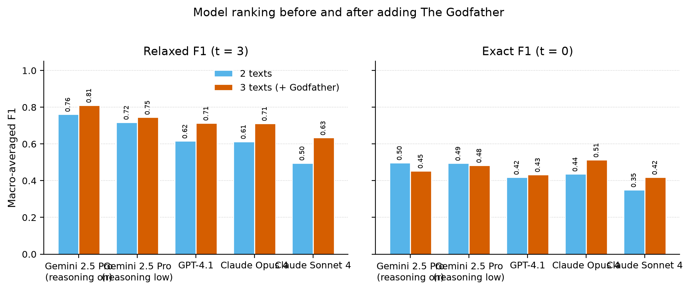
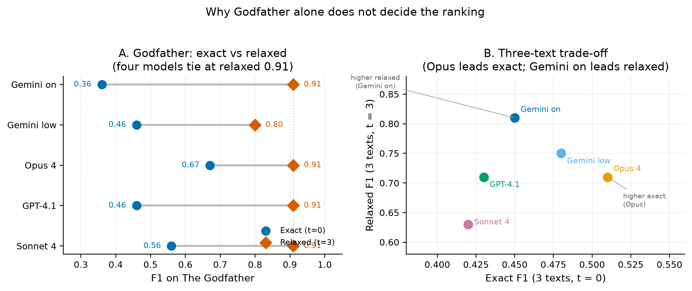
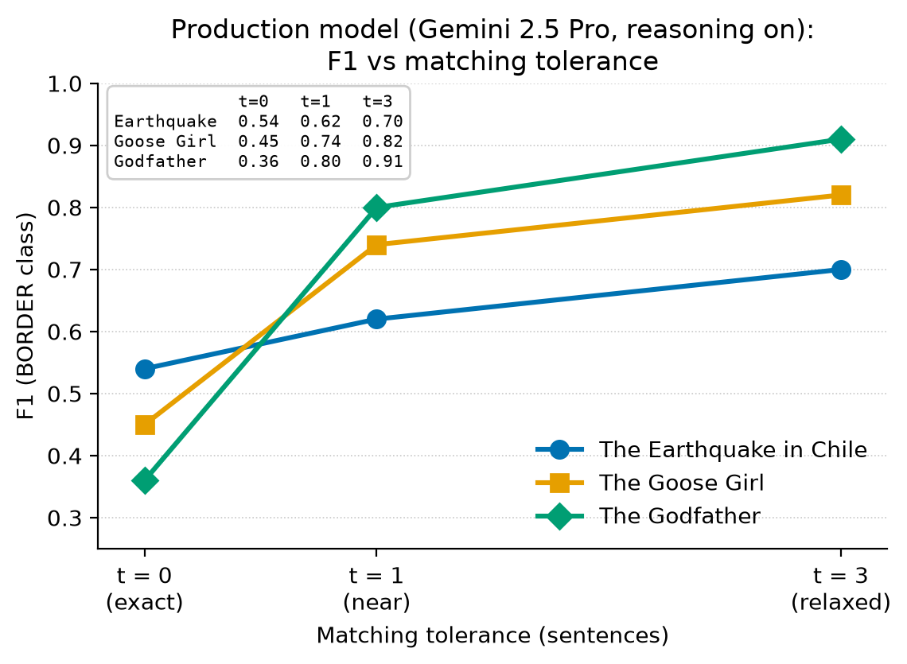
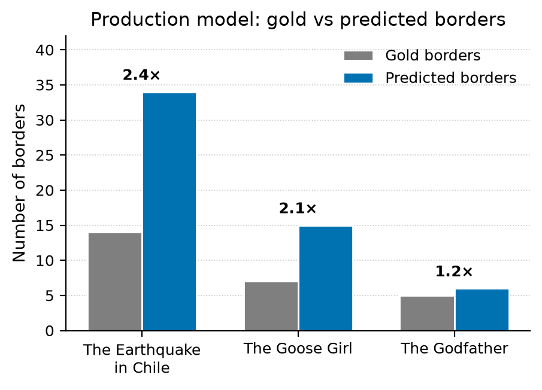

# Automatic Scene Segmentation in Narrative Texts

## Report in the Context of the EmoEvent-Project

### Overview / Purpose

This report stands in the context of our CHR-conference submission *EmoEvent: *xxx. It gives full details on our applied Gemini-pipeline focused on automatically and semantically segmenting literary texts into narrative scenes. Overall, we follow the the LLM-based approach evaluated by Zehe et al. (2025). By using human-labelled texts from our close-reading approach, Gemini's performance on the mentioned task is evaluated. In the end, we segment texts from our distant-reading approach by using Gemini.

### Data Description

#### Close-reading texts (labelled gold standard)

For the close-reading validation sample, we use three short German-language narratives that differ strongly in genre, length, and explicitness of narrative structure: Heinrich von Kleist's novella *The Earthquake in Chile* (*Das Erdbeben in Chili*, 1807) and two Brothers Grimm fairy tales from *Children's and Household Tales* (*Kinder- und Hausmärchen*, edition XXXX) — *The Goose Girl* (*Die Gänsemagd*) and *The Godfather* (*Der Gevatter*, KHM 42).^[TODO-colleagues: specify exact edition of the Grimm tales.]

The set is deliberately contrastive. As a novella, *The Earthquake in Chile* compresses novelistic density into a narrow textual space: the earthquake interrupts Jeronimo's suicide mid-sentence, the lovers' survival and pastoral reunion give way to mob lynching inside a single cathedral scene — all without chapter breaks or transitional formulae. *The Goose Girl*, by contrast, signals every episode boundary through spatial relocation, formulaic refrains ("O du Falada, da du hangest" / "O Falada, hanging there"), and dialogue ritual. *The Godfather* is the shortest of the three (32 sentences, 5 scenes): a poor man takes a mysterious stranger as godfather, receives a healing water that makes him famous, and later climbs the godfather's house past eerie wonders on each floor (fighting brooms, dead fingers, skulls, self-frying fish) before the godfather denies it all and the man flees. Its value for evaluation is as a short-text edge case where scene changes are abrupt and sparsely cued, rather than ritualised like *The Goose Girl*. Together, the three texts test the model on recognising conventional fairy-tale boundaries, detecting implicit transitions in compressed prose, and handling very short narratives with uneven scene lengths.

For *The Earthquake in Chile*, we reused manual scene annotations created in the context of the GermAn Prose dataset (Hatzel et al. 2026). For *The Goose Girl* and *The Godfather*, we used the same annotation guidelines and collected the respective annotation data.^[TODO-colleagues: describe annotation setup for the Grimm tales — number of annotators, adjudication procedure, and IAA (if computed).]

The labelling task is binary at the sentence level: each sentence is assigned either BORDER (a new scene starts at this sentence) or NOBORDER (the current scene continues). By convention, the first sentence of each text is counted as a scene boundary (it opens scene 1).


| Text                                                | Sentences | Scenes | Scene Rate | Mean sents/scene | Median sents/scene |
| --------------------------------------------------- | --------- | ------ | ---------- | ---------------- | ------------------ |
| *The Earthquake in Chile* (*Das Erdbeben in Chili*) | 245       | 14     | 5.7%       | 17.5             | 11.5               |
| *The Goose Girl* (*Die Gänsemagd*)                  | 71        | 7      | 9.9%       | 10.1             | 7                  |
| *The Godfather* (*Der Gevatter*)                    | 32        | 5      | 15.6%      | 6.4              | 4                  |
| **All three**                                       | **348**   | **26** | **7.5%**   | **13.4**         | **7**              |


**Note on annotation format.** Manual annotations assign each sentence a numbered scene ID; a change in this number marks a new scene. For the LLM-based labelling pipeline, this was converted into a binary BORDER/NOBORDER format: BORDER if the scene ID changes from the previous sentence, NOBORDER otherwise. The output columns `is_scene_boundary` and `scene_id` are reconstructed from these binary labels, so both formats are equivalent, while evaluation and prompting use the binary scheme.

#### Distant-reading corpus (unlabelled)

Our distant-reading approach reuses the dProse dataset (Gius et al. 2020). From this corpus, we received a subsample of 327 texts with approximately the same length.^[TODO-colleagues: describe sampling rationale — length window, filtering criteria, and random seed (if applicable).] No gold scene annotations exist for these texts; the automatic segmentation described in this report is their first scene labelling. The table below summarises the subsample:


| Metric                     | Value   |
| -------------------------- | ------- |
| Number of texts            | 327     |
| Total sentences            | 120,369 |
| Mean sentences per text    | 368     |
| Median sentences per text  | 359     |
| IQR (25th–75th percentile) | 284–438 |
| Range (min–max)            | 76–762  |


Figure 1 shows the distribution of text lengths in the subsample. The distribution is approximately normal with a slight right skew; the interquartile range (284–438 sentences) indicates that the majority of texts fall within a relatively narrow band despite the full range spanning 76 to 762 sentences.

Figure 1: dProse subsample — text length distribution (n = 327). Vertical lines mark the median (359) and mean (368); the shaded band shows ±1 SD (112).

### Task Definition

Following Zehe et al. (2021a; 2025), we frame scene segmentation as a binary sentence-level classification task: each sentence is labelled either BORDER, if it opens a new scene, or NOBORDER, if the current scene continues. The concept of a narrative scene draws on narratological tradition (Genette 1983) and was elaborated for computational literary studies by Gius et al. (2019), who characterise a scene as a segment of text exhibiting a coherent pattern across the four dimensions: time, space, characters, and action. A significant break in one or more of these dimensions marks a scene boundary. Zehe et al. (2021a) formalised this definition into the annotation and classification task we adopt here. We keep that shared four-dimensional framing; operational differences—label names, JSON schema, explicit context slots, and restoring “ongoing action” into the zero-shot prompt text—are described with the production template below.

### Model Selection and Evaluation

Zehe et al. (2025) compare supervised BERT-based scene segmentation, zero-shot LLM prompting, and Chain-of-Thought fine-tuning of Llama 3. Their strongest supervised model reaches a relaxed F1 of 0.68 with a tolerance of (t = 3), while the best zero-shot LLM result, GPT-4o, reaches 0.45. Since the training data required for the supervised and fine-tuned alternatives were not available for our pipeline, we focused on a zero-shot LLM approach.

We started from Zehe et al.'s zero-shot prompt (No-CoT; Appendix A.2) and adapted it for our setting. Their template asks for a free-text `True`/`False` answer with a prose reason, names three dimensions in the prompt text (characters, location, time), and wraps the target in `<sentence>...</sentence>` inside an unlabelled context window of roughly 512 tokens (kept comparable to their BERT baselines). A second template, CoT-List, enumerates action, location, time, and characters step by step, but Zehe et al. used it only for fine-tuning, not for zero-shot prompting. Their No-CoT prompt reads:

```text
Does the sentence in <sentence>...</sentence> introduce the beginning of a new
scene and a significant break in time, location or characters? Answer 'True' or
'False' and provide a reason for your decision. A scene is defined as a segment
of text with a coherent structure across the dimensions 'characters' (which
characters are present in the narration), 'location' (where does the narration
take place), and 'time' (continuous time in the narration). A significant break
in any of these dimensions corresponds to a scenes change.
```

Our production prompt (Family B) differs in four main ways: (1) labels are the task’s own `BORDER`/`NOBORDER` names rather than `True`/`False`; (2) output is strict JSON (`label` + `reason`) enforced by a provider-side schema, instead of free-text parsing with retries; (3) the definition restores **ongoing action** alongside time, location, and participating characters; (4) left and right context are labelled explicitly as “Context before” / “Context after” around the marked target. We tested several prompt variants (rubrics, few-shot examples, multi-stage and CoT-style prompts); the short JSON zero-shot form performed best. The Family B template used for the dProse production run is:

```text
Task: Decide whether the marked sentence starts a new event/scene segment.

Definition:
A new segment starts when there is a significant change in time, location,
participating characters, or ongoing action.

Context before:
{left_context}

Target sentence:
<sentence>{target_sentence}</sentence>

Context after:
{right_context}

Return JSON only:
{
  "label": "BORDER" or "NOBORDER",
  "reason": "<short justification>"
}
```

On the gold evaluation texts, models were compared under temperature 0, a fixed seed, and a shared context budget around each target sentence (token-budget mode inherited from Zehe et al., ~409 tokens of surrounding context). For the dProse corpus run we switched to a fixed **12 sentences of context on each side**, still with temperature 0 and the same Family B + JSON schema contract.

Evaluation was conducted on the three manually annotated gold texts. Following Zehe et al. (2025), we report relaxed F1 (t = 3) as the main metric, since it allows near-boundary predictions within three sentences, alongside exact F1 (t = 0) for transparency. All runs used Prompt Family B with identical decoding (temperature 0, seed 1337, token-budget context ~409, JSON schema).

We ranked the same five candidate configurations on all three gold texts (macro-averaged F1). The table reports the original two-text ranking (*The Earthquake in Chile* + *The Goose Girl*) and the updated three-text ranking after adding *The Godfather*:


| Model           | Reasoning | Exact / Relaxed (2 texts) | Exact / Relaxed (3 texts) | *Godfather* Exact / Relaxed |
| --------------- | --------- | ------------------------- | ------------------------- | --------------------------- |
| Gemini 2.5 Pro  | On        | **0.50 / 0.76**           | **0.45 / 0.81**           | 0.36 / 0.91                 |
| Gemini 2.5 Pro  | Low       | 0.49 / 0.72               | 0.48 / 0.75               | 0.46 / 0.80                 |
| Claude Opus 4   | Off       | 0.44 / 0.61               | 0.51 / 0.71               | 0.67 / 0.91                 |
| GPT-4.1         | Off       | 0.42 / 0.62               | 0.43 / 0.71               | 0.46 / 0.91                 |
| Claude Sonnet 4 | Off       | 0.35 / 0.50               | 0.42 / 0.63               | 0.56 / 0.91                 |

*Two-text macros from `2026-05-31-excel-gemini-reasoning-on`, `2026-05-30-excel-3model-sweep`, and `2026-05-30-excel-opus4`. Godfather scores from `2026-07-28-excel-gevatter-gemini-reasoning-on` (Gemini on) and `2026-07-28-excel-gevatter-model-sweep` (other four). Three-text macros average per-document F1 over Kleist, Gaensemagd, and Gevatter.*



Figure 2: Model ranking before and after adding *The Godfather*. Left: relaxed F1 (t = 3); right: exact F1 (t = 0). Bars compare the two-text macro average with the three-text average.

On the headline relaxed metric, Gemini 2.5 Pro with reasoning on remains first after adding *The Godfather* (three-text relaxed F1 **0.81**). Several models reach the same *Godfather* relaxed F1 of 0.91, so that short text alone does not separate them; the longer texts still drive the ranking. Claude Opus 4 is a notable exception on exact match: its strong *Godfather* exact F1 (0.67) lifts the three-text exact score above Gemini’s, but its relaxed F1 stays lower (0.71 vs 0.81) because it over-predicts more on the longer texts. Figure 3 makes this split explicit. We therefore keep Gemini 2.5 Pro with reasoning on as the production configuration.



Figure 3: Why *The Godfather* alone does not decide the ranking. (A) On this short text, four models tie at relaxed F1 0.91, while Opus leads exact match (0.67). (B) On the three-text macro, Gemini with reasoning on leads relaxed F1; Opus leads exact F1 — the production choice follows the headline relaxed metric.

Per-text results for this production setting:


| Text                      | Sentences | Gold   | Pred.  | Over-pred. | F1 (t = 0) | F1 (t = 1) | F1 (t = 3) |
| ------------------------- | --------- | ------ | ------ | ---------- | ---------- | ---------- | ---------- |
| *The Earthquake in Chile* | 245       | 14     | 34     | 2.4×       | 0.54       | 0.62       | 0.70       |
| *The Goose Girl*          | 71        | 7      | 15     | 2.1×       | 0.45       | 0.74       | 0.82       |
| *The Godfather*           | 32        | 5      | 6      | 1.2×       | 0.36       | 0.80       | 0.91       |
| **Macro average**         | **348**   | **26** | **55** | **2.1×**   | **0.45**   | **0.72**   | **0.81**   |

*Per-text metrics recomputed from each run's `review_*.jsonl` against the Excel gold via `src/eval/excel_gold_scoring.py`. Over-prediction = predicted / gold borders.*



Figure 4: Production model (Gemini 2.5 Pro, reasoning on) — F1 vs matching tolerance for each gold text. Exact match (t = 0) is hardest; near-miss (t = 1) and relaxed (t = 3) recover most of the score, especially on *The Godfather* (0.36 → 0.80 → 0.91).



Figure 5: Gold vs predicted borders under the production model. Over-prediction is roughly 2× on the longer texts and milder on *The Godfather* (1.2×).

The results are consistent across all three texts despite their differences in genre and length. Relaxed recall is perfect everywhere for the production model (t = 3 recall = 1.00): it never misses a true boundary by more than three sentences, so relaxed F1 is limited only by false positives (Figures 4–5). Exact F1 is held down by over-prediction and by borders placed one to three sentences off.

Its three-text relaxed F1 of 0.81 is above Zehe et al.'s zero-shot benchmark and their supervised result, though the comparison is only directional because the test corpora differ. The consistent over-segmentation seen here also foreshadows the same tendency at corpus scale on dProse (below).

### Application to dProse-Dataset

We applied the production pipeline (Gemini 2.5 Pro with reasoning on, Prompt Family B, 12 sentences of context on each side, temperature 0, strict JSON schema) to the 327-text dProse subsample through the Gemini Batch API. The corpus was processed in seven cost-capped waves between 2026-06-28 and 2026-07-03 for a total of approximately **$514 USD**; after a three-tier remediation pass (batch retry with a larger token budget, synchronous retry with relaxed safety filters, and a neighbour-consensus patch for 40 sentences that remained blocked), parse success reached **100%** (120,369 / 120,369 sentences).

Across the 327 books, the median BORDER rate is **24.0%** (range 8.9%–41.4%), the corpus-median of per-book median scene lengths is **2 sentences**, and on average **54%** of inferred scenes span only one or two sentences — a first signal that the model tends to segment more finely than coarse narrative scenes.

To verify that Gemini's segmentation approximates our preceding analyses with the three gold texts, we took random samples from dProse and checked the annotations manually for plausibility.

### Final Remarks

The corpus statistics point to a consistent tendency to over-segment: roughly 54% of inferred scenes span only 1–2 sentences, and consecutive-BORDER runs reach up to 13 sentences in a single book (`dprose_1060`). Two lightweight optimisations mitigate this without changing the underlying model: a post-processing rule enforcing a minimum scene length substantially lifts relaxed F1 in our controlled Excel-manifest sweep (t = 3 F1 rises from 0.36 to 0.51 with `min_scene_len ≥ 3`), and a stricter prompt definition (Family L, MAJOR-discontinuity criterion) reduces the BORDER rate by 7–11 pp per text on a four-book dProse spot-check (aggregate borders 234 → 153, −35%). Neither fully dissolves the dense montage or stichomythic-dialogue runs, so a post-processing merge over consecutive borders remains the most direct complement to any prompt-side change.

This over-prediction behaviour aligns with Zehe et al.'s (2025) broader observation that zero-shot LLMs handle sentence-level boundary decisions less reliably than supervised or fine-tuned setups — their supervised BERT baseline uses an overlapping half-stride window that implicitly smooths predictions across neighbouring sentences, an effect our proposed post-processing rules approximate at inference time.

Manual spot-checks suggest two kinds of “false positives.” Some are clearly excessive splits inside one continuous action. In *Die Erscheinung* (`dprose_806`), for example, the model assigns three consecutive BORDER labels as the protagonist stands up, notices a woman across the deck, and walks over to her. In *Die überlaute Frau Bautz* (`dprose_979`), a sanatorium dinner gives way to Sylvester’s exit—fresh air, headache, street, bar, an elbow nudge, a turn of the head, and a girl in a blue jacket—and nearly every physical micro-step becomes its own scene (eleven consecutive BORDERs).

Other over-predictions are more understandable: the model reacts to meaningful but very fine-grained narrative shifts. In *Keuschheitslegende* (`dprose_151`), five consecutive BORDERs track a compressed journey montage (cold → blurred perception → train platform → familiar voices → collapse in her room). In *Der Schein trügt* (`dprose_119`), over-segmentation is driven by a text-within-the-text structure: the frame story’s campfire epilogue, the new section title *Ein Ferienabenteuer*, and the holiday preamble that follows trigger a cluster of seven consecutive BORDERs because narrative-layer and formal chapter cues coincide. In *Das Grab des Herrn Schefbeck* (`dprose_1712`), nine BORDERs cut rapidly between a courtship memory, the funeral bed, phone calls, a car ride, and arrival at the mortuary.

By contrast, under-segmentation also occurs, though less often. In *Das höllische Automobil* (`dprose_137`), a comic dialogue/action episode between the giant Rumbo and Frechdachs remains largely unsegmented for 54 sentences. In *Empfang beim Ministerpräsidenten* (`dprose_702`), a countess’s confidential reception story runs for about forty sentences as a single scene before the listener agrees to help.

These examples indicate that the model is often more fine-grained than the target annotation scheme, rather than simply random or unstable—and that its rarer misses tend to be long unbroken dialogues or single-location social scenes. A post-processing step should therefore distinguish clearly excessive splits inside a continuous action from narratively interpretable fine-grained shifts (montage, section titles, frame transitions, compressed summary), while also watching for conservative stretches that bury a late location or time jump. This is exactly why relaxed F1 (t = 3) remains the more informative headline metric against our gold annotation.