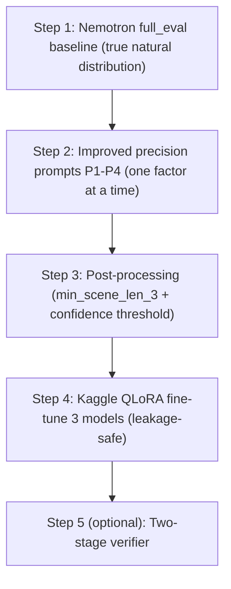

# F3 Precision Improvement Plan

**Date:** 2026-06-08
**Goal:** Maximize **relaxed F1 at tolerance t=3** (the paper headline metric, defined in
[`../reference/2025.naacl-long.500.md`](../reference/2025.naacl-long.500.md) line 171) for scene-boundary
detection on STSS-Test-2, keeping total spend **under 100 EUR** (preferably free).

**Current bottleneck:** precision. On the partial Nemotron full_eval run (190/5025 sentences of
*Aus guter Familie*) recall is ~100% but precision is ~12% (51 predicted borders vs 6 gold). The model
over-segments.

**Related docs:**
- [`FULL_DATASET_PROMPTING_PLAN.md`](FULL_DATASET_PROMPTING_PLAN.md) — full-corpus prompting plan
- [`PROGRESS_REPORT.md`](PROGRESS_REPORT.md) — stratified-bias caveat (lines 68-95)
- [`../corpora/DPROSE_COST_ESTIMATE.md`](../corpora/DPROSE_COST_ESTIMATE.md) — API cost reference
- [`../corpora/SCENE_SEGMENTATION_DE_COST_ESTIMATE.md`](../corpora/SCENE_SEGMENTATION_DE_COST_ESTIMATE.md) — per-split cost

---

## Compute and model decisions (confirmed)

- **Fine-tuning compute:** Kaggle Notebooks via API (free, T4 16GB, 30h/week), driven from the Cursor
  terminal using `kaggle kernels push` with a `~/.kaggle/kaggle.json` API key. No Colab UI.
- **Local `.venv-gpu`** (RTX 2070 8GB) used only for quick smoke tests of data prep.
- **Models to fine-tune and compare:** Llama-3.2-3B, Qwen2.5-3B, Gemma-2-2B (all Unsloth 4-bit QLoRA,
  fit a T4 16GB).

### Why not Google Colab / why these alternatives

| Option | Free? | Driven from Cursor | GPU | Notes |
|--------|-------|--------------------|-----|-------|
| Kaggle Notebooks API | Yes (30h/week) | `kaggle kernels push` + API key | T4 16GB / P100 | **Chosen.** Fits up to ~7-8B QLoRA |
| Local `.venv-gpu` | Yes | `python` directly | RTX 2070 8GB | Only <=3B QLoRA; 8B OOM'd before |
| HF Jobs | No (HF Pro needed) | `hf jobs uv run` / MCP | a10g/a100 | Cheapest paid cloud; within budget |
| Modal / RunPod / vast.ai | No (pay/use) | SDK/CLI + API key | T4-A100 | ~0.4-1 USD/hr; needs card |

### Free models to fine-tune (beyond Llama)

Open-weight, permissive, good German, QLoRA-friendly: Qwen2.5 (0.5-7B), Gemma 2 (2B/9B),
Llama 3.2 (1B/3B), Phi-3.5-mini (3.8B), Mistral 7B v0.3, SmolLM2 1.7B, EuroLLM (European-focused),
and German-specialized LeoLM / DiscoLM-German / occiglot. Fit guide: 8GB local -> 0.5-3B;
Kaggle T4 16GB -> up to 7-8B.

---

## Pipeline overview



---

## Step 1 — Finish Nemotron full_eval baseline (EUR 0)

Resume the in-progress run; the per-doc cache resumes automatically (currently 190/5025 on
*Aus guter Familie*).

```bash
source .venv/bin/activate
export OPENROUTER_API_KEY=...   # required
python src/runners/run_prompting_stratified.py \
  --full_eval \
  --prompt_family B \
  --reasoning off \
  --model "nvidia/nemotron-3-super-120b-a12b:free" \
  --date 2026-06-06 \
  --context_size 409 --temperature 0.0 --top_p 1.0 --seed 1337 --max_tokens 256
```

- Run both novels (*Aus guter Familie*, *Effi Briest*).
- Headline P/R/F1 at tol 0/1/3 are computed by `evaluate_sampled` in
  [`../../src/runners/run_prompting_stratified.py`](../../src/runners/run_prompting_stratified.py)
  (lines 517-559) and written to `results_<stem>.json`.
- This is the FIRST true natural-distribution baseline; prior numbers were stratified-inflated.
- **Deliverable:** baseline F1@3 number to beat. Log via
  `research_log/runs/2026-06-06__prompting__baseline__nemotron-full-eval-stss2.md`.

---

## Step 2 — Improved precision prompts (EUR 0)

New variants build on prompt B
([`../../src/prompts/B_zero_shot_json.txt`](../../src/prompts/B_zero_shot_json.txt)). Files added and
registered in [`../../src/prompts/registry.json`](../../src/prompts/registry.json):

- **P1 negative examples** — `src/prompts/K_zero_shot_json_negatives.txt`: adds a NOT-a-border list
  (dialogue continuation, minor time progression, internal thoughts).
- **P2 stricter definition** — `src/prompts/L_zero_shot_json_strict.txt`: BORDER only on a MAJOR
  discontinuity (time AND/OR place AND/OR character constellation); minor transitions are NOBORDER.
- **P4 FP-pattern guard** — `src/prompts/M_zero_shot_json_fp_guard.txt`: explicit list of the paper's
  known FP triggers (memory/flashback, future plans, time-jumps in non-scenes; paper section 8).
- **P3 confidence threshold** — not a prompt; implemented in Step 3 post-processing (uses the
  `confidence` field B already emits).

`src/core/prompt_runtime.py` is extended so families K/L/M parse like B (JSON label+confidence).

### Experiment protocol (one variable at a time)

Fixed controls (from
[`../../research_log/experiments/experiment__prompting__stss2-section52-campaign.md`](../../research_log/experiments/experiment__prompting__stss2-section52-campaign.md)):
model = Nemotron-Super-120B free, temperature=0, seed=1337, context=409, reasoning=off,
evaluator = the stratified runner.

```bash
# Pilot screen (fast), one family at a time:
for FAM in K L M; do
  python src/runners/run_prompting_stratified.py \
    --prompt_family $FAM --reasoning off --max_per_class 15 \
    --context_size 409 --temperature 0.0 --seed 1337 --max_tokens 256
done
# Promote winners to --full_eval (drop --max_per_class).
```

- Primary metric F1@3; secondary precision@0; control recall@0 (must not regress materially).
- Corpus: [`../../data/manifests/stss_test_2.json`](../../data/manifests/stss_test_2.json).

---

## Step 3 — Post-processing (EUR 0)

Reusable module refactored from `apply_min_scene_len` in
[`../../scripts/evaluation/export_top_fp_review_table.py`](../../scripts/evaluation/export_top_fp_review_table.py):

- `src/postprocess/postprocess.py` — `apply_min_scene_len(labels, min_gap)`,
  `apply_burst_collapse(labels)`, `apply_confidence_threshold(labels, confidences, thr)`.
- `src/postprocess/run_postprocess.py` — CLI: takes a run cache/results JSON + tolerance, applies a
  rule, re-scores with `evaluate_sampled`.

```bash
python src/postprocess/run_postprocess.py \
  --cache outputs/runs/prompting/2026-06-06/full_.../cache_Aus_guter_Familie.json \
  --rule min_scene_len_3 --tolerances 0 1 3
```

**Gap analysis (from gold):** Gaensemagd min gap=3, Kleist min gap=1; `min_scene_len_5` would delete
17-31% of TRUE borders, so default to **min_scene_len_3** plus **confidence threshold** (P3).
Apply on top of the Step 2 winner.

---

## Step 4 — Kaggle QLoRA fine-tuning, 3 models (EUR 0)

### 4a. Leakage-safe data prep

`src/finetune/build_sft_dataset.py` reads STSS-Test-2 XMI gold (via the XMI parser pattern in
[`../../src/data/build_fewshot_from_stss.py`](../../src/data/build_fewshot_from_stss.py)) and the Excel
gold CSVs under [`../../data/processed/excel_prompting/`](../../data/processed/excel_prompting/), then
emits CoT-List-style SFT JSONL (instruction = the IMPROVED Step-2 prompt; target = short rationale +
JSON label).

**Leave-one-text-out folds** to avoid train/test leakage (STSS-Test-2 is the paper's test set):

- **Fold A:** train = Excel (Kleist+Gaensemagd) + *Aus guter Familie*; eval = *Effi Briest*.
- **Fold B:** train = Excel + *Effi Briest*; eval = *Aus guter Familie*.

Stratified split preserving the ~4% border rate.

### 4b. Kaggle training kernel

- `src/finetune/kaggle/train_kernel.py` — Unsloth QLoRA (4-bit), `FastLanguageModel`, LoRA r=16,
  TRL `SFTTrainer`, seed=1337. Parametrized by base model via env so one kernel serves all three.
- `src/finetune/kaggle/kernel-metadata.json` — Kaggle kernel metadata (GPU enabled).
- `src/finetune/kaggle/push_kernel.sh` — `kaggle kernels push` wrapper (reads `~/.kaggle/kaggle.json`).
- Trains Llama-3.2-3B, Qwen2.5-3B, Gemma-2-2B; pushes each LoRA adapter to HF Hub (Kaggle output is
  ephemeral).

### 4c. Evaluation

- `src/finetune/eval_finetuned.py` — loads an adapter, predicts on the held-out fold, scores F1 at
  tol 0/1/3 with the same `evaluate_sampled`. Report both folds (mirrors paper leave-one-text-out).
  Target F1@3 ~0.55-0.62.

---

## Step 5 — Optional two-stage verifier (EUR 7-15)

`src/runners/run_two_stage_verify.py`: Stage 1 reads predicted BORDERs from an existing cache; Stage 2
re-queries a verifier (Gemini batch, or a free reasoning model) ONLY on predicted borders (optionally
only `confidence < 0.85`), with the SAME context window, asking "is this BORDER correct?". Demotes
rejected borders to NOBORDER, then re-scores.

**Cost note (context question):** each Stage-2 call still includes the full surrounding context
(~620 input tokens), so the per-call size is unchanged; only the NUMBER of calls drops from all
sentences to just predicted borders. Cost scales with predicted-border count (~2k on Test-Full ->
~EUR 7-13 standard, ~EUR 4-7 batch); confidence-filtering cuts it further.

---

## Logging (per `../../rule.md`)

- Experiment note: `research_log/experiments/experiment__improvement__f3-precision-campaign.md`
  (factor-under-test per step).
- One run note per run in `research_log/runs/` using
  [`../../research_log/templates/run_template.md`](../../research_log/templates/run_template.md).
- Decision note in `research_log/decisions/` if the active baseline changes.
- Artifacts under `outputs/runs/` (gitignored) + artifact notes in `research_log/artifacts/`.

---

## Metrics and success criteria

- **Primary:** relaxed F1@3 on STSS-Test-2, beating the Step-1 true baseline.
- **Secondary:** precision@0 up without recall@0 collapse.
- **Stretch:** approach the paper's fine-tuned Llama3:8b CoT-List F1@3 = 0.62 with a smaller free model.

## Budget

- Steps 1-4: EUR 0 (free Nemotron + free Kaggle).
- Step 5 optional: EUR 7-15 (or free with a rate-limited model).
- Total worst case: well under EUR 100.
